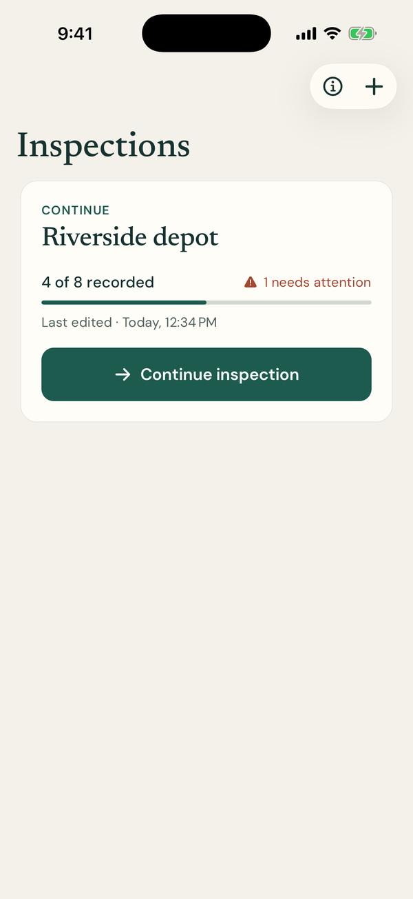
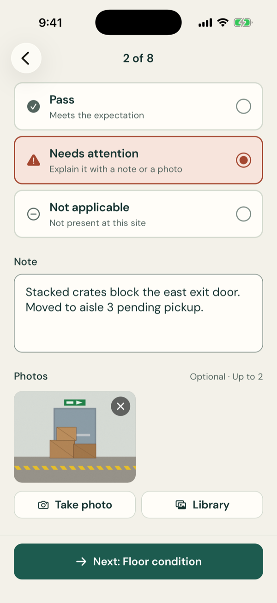
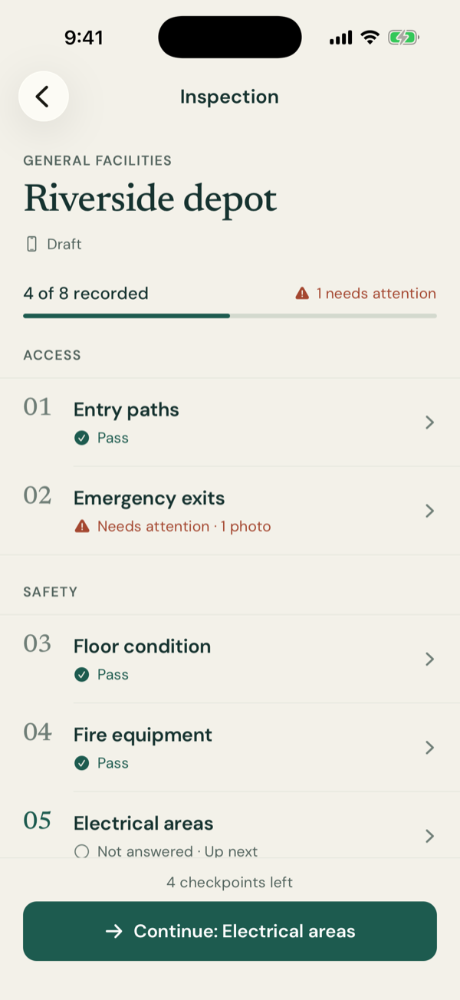
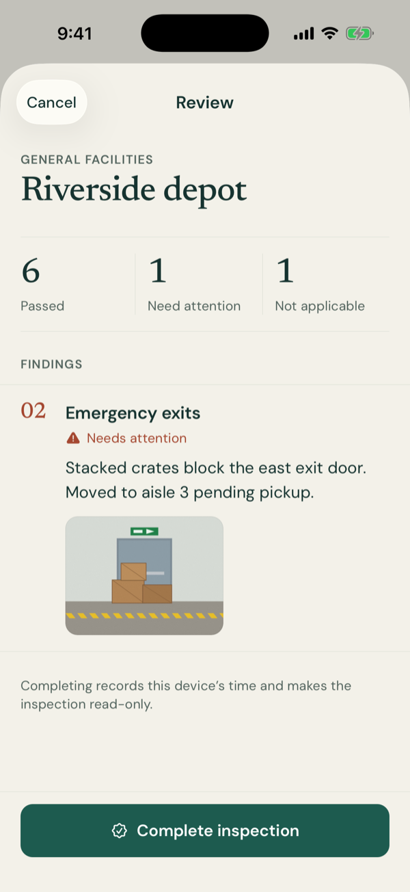

<div align="center">
  <p>
    <a align="center" href="https://www.folderit.net" target="_blank">
      
    </a>
  </p>

<br>

[mobile field inspections](https://github.com/FolderITDev/mobile-field-inspections)

<br>

[](LICENSE.md)


</div>

<details>
<summary><strong>Table of Contents</strong></summary>

- [Hello](#hello)
- [Overview](#overview)
  - [What this is](#what-this-is)
  - [What this is not](#what-this-is-not)
  - [Features](#features)
- [Screenshots](#screenshots)
- [Install](#install)
- [Quickstart](#quickstart)
- [Architecture](#architecture)
  - [Repository layout](#repository-layout)
  - [Engineering decisions](#engineering-decisions)
- [Tests and verification](#tests-and-verification)
- [Privacy and limitations](#privacy-and-limitations)
- [Documentation](#documentation)
- [FAQ](#faq)
- [License](#license)

</details>

## Hello

**[Folder IT](https://folderit.net) is a nearshore software development company that builds and scales AI-ready engineering teams for U.S. companies.** With 220+ software engineers, Folder IT delivers senior technical talent for organizations building AI software.

**Core capabilities:** Nearshore Staff Augmentation · AI-Ready Engineering Teams · AI Software Development · IoT Development · Web & Mobile Apps · Salesforce Consulting · ServiceNow Development

This repository is one example of that work: **Field Inspections**, an offline app for iOS and Android built with React Native, Expo SDK 57 and strict TypeScript. An inspector walks an eight-checkpoint facilities checklist, records pass, finding or not-applicable answers with notes and photos, leaves and resumes the draft at any time, and closes a read-only inspection.

## Overview

### What this is

- A **runnable mobile reference app** that shows how an inspection draft and its photos survive an interrupted, offline workflow: every answer is saved as it is made, and a failed save is never silently dropped.
- An example of **local-first mobile engineering**: SQLite as the source of truth, versioned migrations, optimistic revisions and a serialized write queue.
- Original source code under the MIT license, with a general-facilities checklist, licensed bundled fonts and fictional test fixtures.

### What this is not

- Not a regulatory or compliance assessment tool. The checklist is a generic facilities walk-through.
- Not connected to any backend. There are no accounts, analytics, cloud sync, report export or model APIs.
- Not a form builder. The template is fixed and versioned in code.
- Not distributed through the App Store or Google Play. Store builds are outside the current scope.

### Features

- **Eight checkpoints in three groups:** Access (entry paths, emergency exits), Safety (floor condition, fire equipment, electrical areas) and Condition (lighting, ventilation, equipment storage).
- **Three answers per checkpoint:** Pass, Needs attention or Not applicable. A finding needs a note or a photo before the inspection can be completed.
- **Up to two photos per checkpoint**, from the camera or the library. Images are resized to at most 1600 px, re-encoded as JPEG and copied into app storage before the record references them.
- **Autosave with an honest status.** Answers save immediately and notes after a short pause; a **Saving…** or **Not saved** label stays visible, and leaving the screen with an unsaved change asks before discarding it.
- **Resumable drafts.** The home screen offers the latest draft first, with progress and the number of findings, and the checklist always points to the next unanswered checkpoint.
- **Review before closing.** A summary of passed, needs-attention and not-applicable items lists every finding with its note and photos. Completed inspections are read-only.
- **Accessible by default.** Screen-reader labels and radio semantics, 50-point minimum touch targets, Dynamic Type and status conveyed in words, not only color. Light and dark palettes follow the system.

## Screenshots

<p align="center">
  
  
  
  
</p>

<sub>Captured on the iOS Simulator (iPhone 17 Pro, iOS 26.5) from a development build of this repository. The site and notes are fictional; the photo is an original synthetic illustration used as test media. Below the draft card the home screen shows only its background, which the home capture reproduces at full screen height.</sub>

## Install

Requirements:

- **Node.js 24 or later** and npm (the repo pins Node in `.node-version`).
- **Xcode** with an iOS Simulator, or **Android Studio** with an emulator, to run the native app. A physical device is needed to test the real camera.
- No API keys, accounts or environment variables.

Clone the repository and install the locked dependencies:

```bash
git clone https://github.com/FolderITDev/mobile-field-inspections.git
cd mobile-field-inspections
npm ci
```

This folder is standalone: it has its own dependencies and lockfile and imports nothing from other Folder IT repositories.

## Quickstart

Build and launch a native development build (the first build takes a few minutes):

```bash
npm run ios
```

```bash
npm run android
```

Later sessions only need the dev server, which serves on port `8082`:

```bash
npm start
```

A browser review build is also available with `npm run web`. It stores records in IndexedDB instead of SQLite and is meant for quick UI review, not as evidence of native behavior.

**Two-minute demo**

1. Tap **+**, enter a site name (for example `Riverside depot`) and choose **Start**.
2. Choose **Continue** and answer the first checkpoint. Mark one as **Needs attention** and add a note or a photo.
3. Go back to the home screen, or close the app. The draft is listed under **Continue** with its progress.
4. Resume it, answer the remaining checkpoints and choose **Review and complete**.
5. Check the summary and tap **Complete inspection**. The inspection moves to history and can no longer be edited.

## Architecture

```text
┌────────────────────────────┐
│ src/app/   Expo Router     │  Thin route files: compose screens only
└─────────────┬──────────────┘
              ▼
┌────────────────────────────┐
│ src/features/  Screens     │  Checklist, checkpoint autosave, review
└─────────────┬──────────────┘
              ▼
┌────────────────────────────┐
│ src/data/store  Queue      │  Serialized writes; UI updates after success
└──────┬──────────────┬──────┘
       ▼              ▼
┌─────────────┐ ┌────────────────────────────┐
│ src/domain  │ │ src/data  Repositories     │
│ Template    │ │ SQLite (native)            │
│ Pure rules  │ │ IndexedDB (web review)     │
│ Validation  │ │ Photo files in documents   │
└─────────────┘ └────────────────────────────┘
```

A checkpoint screen batches its pending patch and asks the store to apply it. The store runs a pure domain transition on the latest committed inspection, writes it through the repository and only then publishes the new state. If the write fails, the patch is kept for retry and the screen shows **Not saved**.

### Repository layout

| Path | What it holds |
|------|---------------|
| `src/app/` | Expo Router route entry points and the root layout. |
| `src/features/` | Inspection list, new inspection, checklist, checkpoint and review screens, plus the autosave hook. |
| `src/domain/` | The versioned checklist template, pure transitions and runtime validation. |
| `src/data/` | SQLite and IndexedDB repositories, the mutation queue and durable photo storage. |
| `src/ui/`, `src/theme/` | Shared components and design tokens. |
| `src/hooks/`, `src/lib/` | Focused interaction helpers, formatting, dialogs and haptics. |
| `tests/` | Domain rules, formatting, migrations, restart and conflict tests. |
| `docs/` | Architecture decisions, AI-assisted engineering notes, publishing checklist and font licenses. |

### Engineering decisions

- **One aggregate per row.** Each inspection, with all its answers, is stored as validated JSON in a SQLite row with an explicit revision. Saving an answer is atomic and the schema stays small.
- **Template integrity.** The checklist carries a version. Records with missing or duplicate checkpoints are rejected.
- **Optimistic revisions.** Every write states the revision it started from. A stale revision is rejected, not silently overwritten.
- **Versioned migrations.** A database written by a newer schema is rejected without a destructive reset.
- **Media before reference.** Photos are copied into app storage before an answer points to them. Unreferenced files are cleaned after a 24-hour grace period, so a save still in flight never loses its photo.
- **No silent data loss on navigation.** Leaving a checkpoint flushes pending changes first; if that fails, the user decides whether to discard.
- **No global state library.** Ephemeral state lives in screens and focused hooks; SQLite is the source of truth.

Full rationale: [`docs/architecture.md`](docs/architecture.md).

## Tests and verification

```bash
npm run check          # ESLint, strict TypeScript and the test suite
npm run format:check   # Prettier
npx expo-doctor        # Expo dependency and config checks
```

The suite runs with Node's built-in test runner and a real SQLite database (`node:sqlite`). It covers:

- Findings require context before closing, and completed inspections are immutable.
- Photo evidence can support a finding and is limited to two files.
- Template integrity rejects missing or duplicate checkpoints.
- The summary names the next checkpoint and counts findings without context.
- The journal lists drafts first, newest edit on top.
- Migration, durable restart and optimistic concurrency.
- A newer schema is rejected without a destructive reset.
- Malformed persisted data is surfaced, not overwritten.
- Times and UTC offsets use the recorded zone, including half-hour zones and moments with seconds.

The same checks run in GitHub Actions on every push and pull request ([`.github/workflows/quality.yml`](.github/workflows/quality.yml)).

**Manual verification.** The full flow has been exercised on the iOS Simulator and on **physical iOS and Android devices**, including camera capture, permission granted and denied, airplane mode and restart. CI does not and cannot cover these checks.

## Privacy and limitations

- Records and photos are stored only on the device, inside the operating system sandbox, and the app does not encrypt them further. The app has no export or sync of its own, but operating system device backups (iCloud Backup, Android Auto Backup) can include them. Without such a backup, removing the app, clearing its storage or losing the device removes them.
- Photos are re-encoded before storage, which drops most embedded metadata. Do not treat this as a forensic guarantee.
- The device clock can be changed by the user. Completion times record what the device reported.
- The browser review build uses IndexedDB, whose quota and eviction rules depend on the browser.
- Camera permission is requested only when the user chooses **Take photo**. Picking from the library is always available as an alternative.

## Documentation

- [Architecture and decisions](docs/architecture.md)
- [Design system](DESIGN.md): Newsreader and DM Sans on a calm field-journal palette.
- [AGENTS.md](AGENTS.md): rules and workflow for contributors and AI coding agents.
- [AI-assisted engineering](docs/ai-engineering.md): how AI coding agents are used and reviewed.
- [Contributing](CONTRIBUTING.md) · [Security](SECURITY.md) · [Third-party notices](THIRD_PARTY_NOTICES.md)

## FAQ

<details>
<summary>What is Folder IT?</summary>

Folder IT is a nearshore software development and AI staff augmentation company. It builds and staffs AI Pods — small, senior engineering teams led by a Forward Deployed Engineer — for US-based companies.

</details>

<details>
<summary>What services does Folder IT provide?</summary>

Folder IT provides nearshore software engineering services for US companies:

- Artificial Intelligence Project Development (GenAI, LLMs, RAG systems, AI Agents, NLP, Computer Vision, MLOps)
- AI Pods and AI Solutions Builder
- IT Staff Augmentation & Outsourcing
- ServiceNow Implementation & Integration
- Salesforce Services
- Web Apps Development
- Mobile Apps Development
- Internet of Things Project Development
- Data Migration & Integration

</details>

<details>
<summary>What is a Folder IT AI Pod?</summary>

An AI Pod is a delivery model where one senior engineer (the Forward Deployed Engineer) owns a problem end to end, working with AI coding agents as a core part of the execution stack, backed by an internal AI Lab for architecture and technical review. It is not a project manager coordinating a team of developers.

</details>

<details>
<summary>Is this repository production-ready?</summary>

No. Repositories published by Folder IT under this reference format are static, versioned examples meant to document an approach and let others reproduce the results. They are not maintained as production dependencies. Field Inspections in particular has no export or sync of its own.

</details>

<details>
<summary>Can I use this code commercially?</summary>

Yes, under the license specified in this repository (see the [LICENSE](LICENSE.md) file). Bundled fonts keep their own licenses, listed in [THIRD_PARTY_NOTICES.md](THIRD_PARTY_NOTICES.md).

</details>

<details>
<summary>Does this repository call any external LLM or API?</summary>

No. The app makes no network requests at runtime: no backend, analytics, model API or remote fonts. During development, the app loads its JavaScript from the local Expo dev server.

</details>

<details>
<summary>Can I change the checklist?</summary>

Yes, in code. The template lives in `src/domain/model.ts` and carries a version number. Changing it means bumping that version and deciding how existing drafts migrate. There is no in-app form builder.

</details>

<details>
<summary>What happens if the app closes in the middle of an inspection?</summary>

Every answer that showed as saved is already in SQLite. When the app opens again, the draft appears under **Continue** at the same progress. A change still marked **Saving…** at the moment the app was killed may be lost; that is why the status stays visible.

</details>

<details>
<summary>How can I contact Folder IT?</summary>

Through [folderit.net](https://folderit.net).

**Nearshore IT Staff Augmentation | Top LATAM Developers | Folder IT** — scale your engineering team and hire developers from Argentina. Same timezone, lower cost, 25+ years with US companies. [Talk to our team](https://folderit.net).

</details>

## License

Released under the [MIT License](LICENSE.md). Copyright (c) 2026 Folder IT.

<br>

<div align="center">
  <p>
<a href="https://www.linkedin.com/company/folderit"></a>&nbsp;&nbsp;&nbsp;&nbsp;&nbsp;<a href="https://www.instagram.com/folderit.social/"></a>&nbsp;&nbsp;&nbsp;&nbsp;&nbsp;<a href="https://x.com/folderit"></a>&nbsp;&nbsp;&nbsp;&nbsp;&nbsp;<a href="https://www.youtube.com/@folderit"></a>&nbsp;&nbsp;&nbsp;&nbsp;&nbsp;<a href="https://www.tiktok.com/@folder_it"></a>&nbsp;&nbsp;&nbsp;&nbsp;&nbsp;<a href="https://www.facebook.com/folderit.social"></a>
  </p>
</div>
